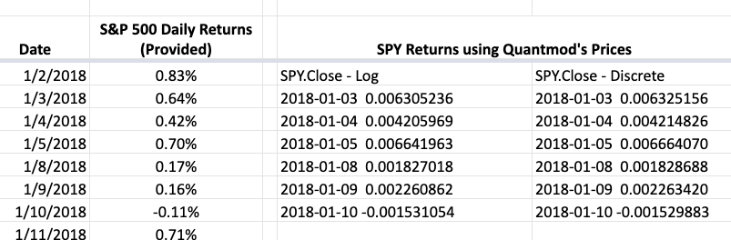
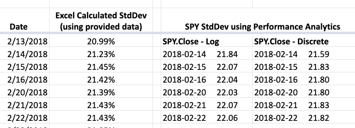

#### [_Visit Website_](https://stock-vol.shinyapps.io/stockVis/)

# Code Challenge

- Create a 30-day rolling volatility chart in an R Shiny app. using S&P 500 Index daily returns going back to January 1, 2017.
- Build functionality in the app to allow an end user to choose among three different lookback periods, the stated 30 day period as well as 10 days and 60 days.  
- Construct chart to a level where information is presentable to an end user.

### Approach
  - Setup development environment -- download RStudio via Anaconda
  - Get familiar with R's syntax and functions/methods
  - Research R Shiny
  - Find a simple tutorial producing a similar application
  - Launch a sample application
  - Implement new code and test results within RStudio console
  - Compare results to the excel data provided using Google Sheets (_using a Mac_)

### General Resources
- [RStudio Tutorial - YouTube](https://www.youtube.com/watch?v=mcYcjH-1giM)
- [Shiny Tutorial](https://shiny.rstudio.com/tutorial/)
- [R Programming Tutorial - YouTube](https://www.youtube.com/watch?v=_V8eKsto3Ug)

### Technical Resources
- RStudio
  - R development environment
- [Shinyapps](https://www.shinyapps.io/)
  - Deployment
- Significant Packages:
  - Shiny
    - Build interactive web apps
     - rsconnect (Deployment Interface for R Markdown Documents and Shiny Applications)
  - [Quantmod](https://cran.r-project.org/web/packages/quantmod/quantmod.pdf)
    - Allow app to retrieve the ticker's historical daily prices - `getSymbols`
    - Create chart - `chartSeries`
  - [PerformanceAnalytics](https://cran.r-project.org/web/packages/PerformanceAnalytics/PerformanceAnalytics.pdf)
    - Calculate portfolio standard deviation - `StdDev`
      - Rollapply (required `zoo` package)
  - Glue
    - String interpolation

 ### Code Snippet

 ````
 ui <- fluidPage(
 .
 .  #User interface and default input values
 .
 .
 # Server logic
 dataInput <- reactive({
    data = getSymbols(input$symb, src = "yahoo",
               from = input$dates[1],
               to = input$dates[2],
               auto.assign = FALSE)

    asset_returns_xts <- na.omit(Return.calculate(data[,4], method = "log"))

    window = input$integer
    if (!input$adjust) {
      spy_rolling_sd <- na.omit(rollapply(asset_returns_xts,
                                window, function(x) round(StdDev(x) * 100, 2)))
    } else {
      spy_rolling_sd <- na.omit(rollapply(asset_returns_xts,
                                window, function(x) round(StdDev.annualized(x) * 100, 2)))
    }
  })


  output$plot <- renderPlot({
    chartSeries(dataInput(), theme = chartTheme("white"),
                type = "line", log.scale = FALSE, TA = NULL,
                name = glue('{input$symb} {input$integer} Day Rolling Volatility (%)'))
  })
  .
  .
  .
  shinyApp(ui, server)
 ````

### Testing

##### Return Calculation Comparison


##### Standard Deviation Comparison  

